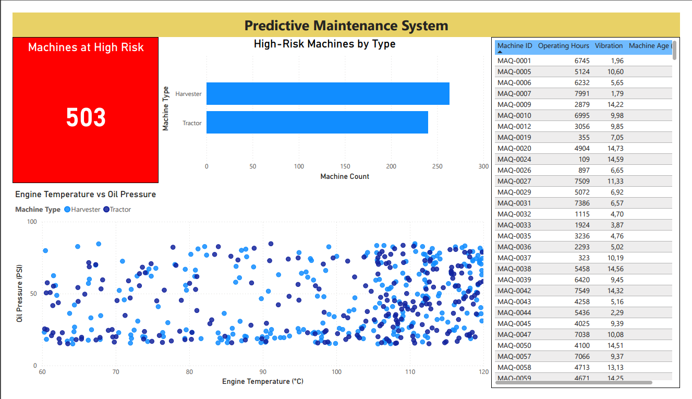

# 🚜 Predictive Maintenance System

<p align="center">


</p>

---

# 📌 Project Overview

Predictive Maintenance System is an end-to-end Machine Learning project that simulates predictive maintenance for agricultural machinery.

The project generates a synthetic dataset representing sensor readings from tractors and harvesters, trains a Random Forest classifier to identify machines at high risk of failure, exports technical reports, and visualizes the results through an interactive Power BI dashboard.

The objective is to demonstrate a complete Data Science workflow, from data generation and model training to business-oriented reporting and visualization.

---

# 💼 Business Problem

Unexpected machinery failures can interrupt agricultural operations, increase maintenance costs, reduce productivity, and generate unnecessary downtime.

Predictive maintenance uses sensor data and Machine Learning models to identify equipment that is likely to fail before an actual breakdown occurs.

This project simulates that scenario by predicting high-risk machines based on operating conditions and exporting the results for maintenance teams.

---

# 🛠 Technology Stack

| Category | Technologies |
|-----------|--------------|
| Programming Language | Python 3.14 |
| Data Processing | Pandas, NumPy |
| Machine Learning | Scikit-Learn |
| Model | Random Forest Classifier |
| Visualization | Microsoft Power BI |
| Reports | Excel, TXT, PDF |
| Version Control | Git & GitHub |

---

# 📊 Dataset

A synthetic dataset was generated using Python to simulate agricultural machinery operating under different conditions.

The dataset contains **1,000 machine records**.

### Features

| Feature | Description |
|----------|-------------|
| Machine_ID | Machine identifier |
| Machine_Type | Tractor or Harvester |
| Operating_Hours | Total operating hours |
| Engine_Temperature | Engine operating temperature |
| Oil_Pressure | Oil pressure |
| Vibration | Machine vibration level |
| Machine_Age | Machine age in years |
| Failure | Target variable (0 = Normal, 1 = Failure) |

The target variable is generated according to predefined sensor thresholds, creating a realistic binary classification problem.

---

# 🔬 Machine Learning Pipeline

The project follows a complete Machine Learning workflow.

### 1. Synthetic Dataset Generation

Machine operating data is generated using NumPy to simulate real sensor measurements.

### 2. Data Preparation

Relevant sensor variables are selected as input features.

### 3. Train/Test Split

The dataset is divided into training and testing subsets using an 80/20 split.

### 4. Model Training

A Random Forest classifier is trained to predict machine failures.

### 5. Model Evaluation

The model is evaluated using the Scikit-Learn classification report.

### 6. Feature Importance

Feature importance is calculated to identify which sensors contribute most to failure prediction.

### 7. Failure Prediction

Predictions are generated for all machines, identifying those considered at high risk.

### 8. Report Generation

Results are automatically exported to Excel and TXT files for business reporting.

### 9. Dashboard Visualization

Power BI is used to present the results through interactive charts and KPIs.

---

# 📈 Power BI Dashboard



<br>

The dashboard summarizes the predictive maintenance analysis through business-oriented visualizations.

It includes:

- High-risk machine KPI
- Machine distribution by type
- Engine Temperature vs Oil Pressure visualization
- High-risk machine table
- Interactive filtering

Project files:

- `predictive_maintenance_dashboard.pbix`
- `predictive_maintenance_report.pdf`

---

# 📄 Generated Reports

After running the pipeline, the following reports are automatically generated:

| File | Description |
|------|-------------|
| machines_at_risk.xlsx | List of predicted high-risk machines |
| model_summary.txt | Model performance and feature importance |
| predictive_maintenance_report.pdf | Dashboard exported from Power BI |

---

# 📁 Project Structure

```text
predictive-maintenance-system/
│
├── data/
│   └── machine_sensors.csv
│
├── reports/
│   ├── predictive_maintenance_dashboard.pbix
│   └── predictive_maintenance_report.pdf
│
├── results/
│   ├── machines_at_risk.xlsx
│   └── model_summary.txt
│
├── src/
│   ├── generate_machine_data.py
│   └── predictive_maintenance.py
│
├── README.md
├── requirements.txt
├── LICENSE
└── .gitignore
```

---

# 🚀 Installation

Clone the repository:

```bash
git clone https://github.com/mauriciocasanovas/predictive-maintenance-system.git
```

Navigate to the project folder:

```bash
cd predictive-maintenance-system
```

Install the required dependencies:

```bash
pip install -r requirements.txt
```

---

# ▶️ Usage

Generate the synthetic dataset:

```bash
python src/generate_machine_data.py
```

Run the predictive maintenance pipeline:

```bash
python src/predictive_maintenance.py
```

The execution will automatically:

- Generate predictions
- Export an Excel report
- Export a technical TXT report
- Create data ready for the Power BI dashboard

Open the Power BI dashboard to explore the results visually.

---

# 📈 Results

The project demonstrates how Machine Learning can support predictive maintenance by identifying machinery with a higher probability of failure before an actual breakdown occurs.

The generated dashboard provides a business-friendly overview of:

- Machines predicted at high risk
- Distribution by machine type
- Sensor behavior
- Operational indicators

---

# 👨‍💻 Author

**Mauricio Javier Casanovas Juárez**

GitHub: https://github.com/mauriciocasanovas

---